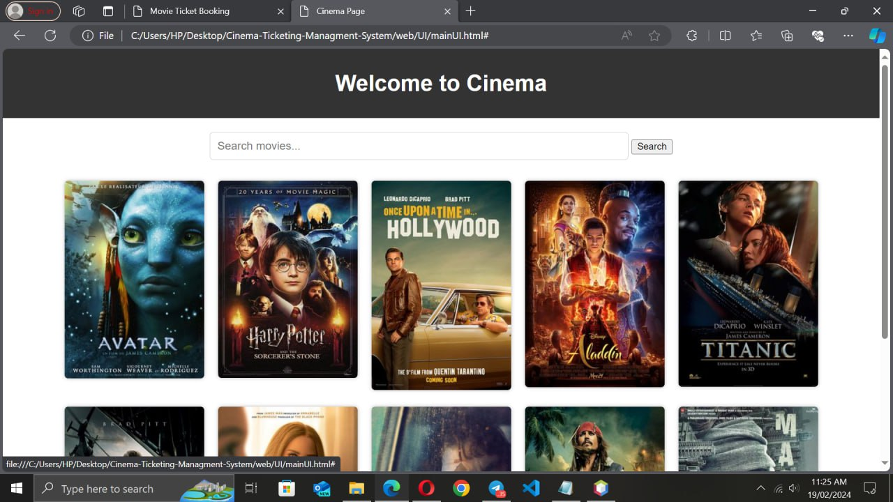
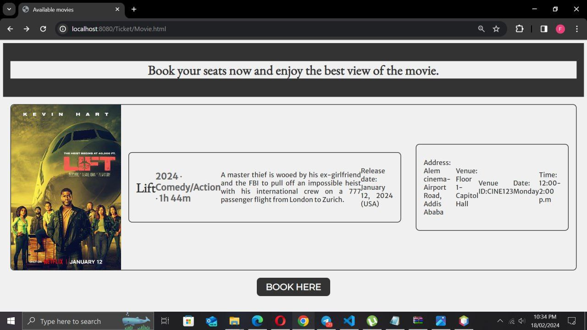
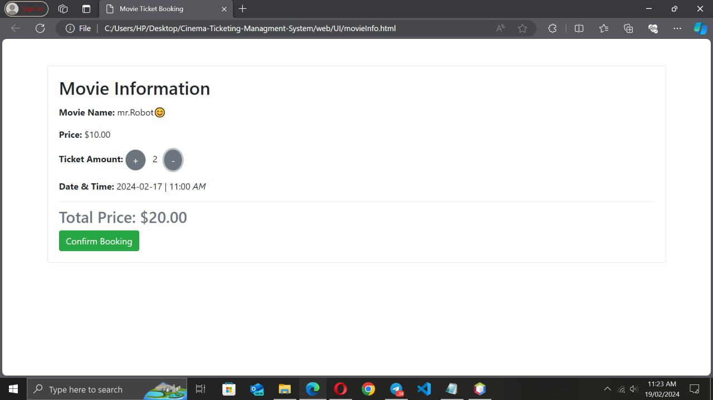
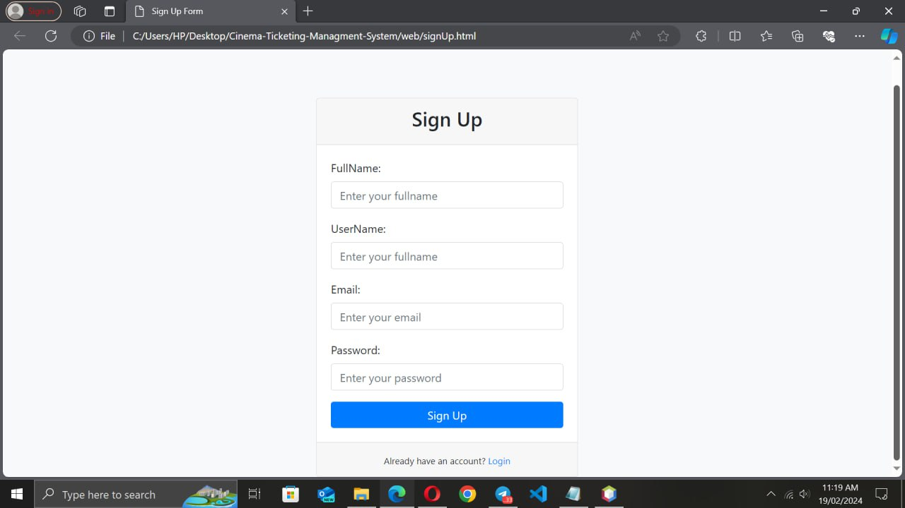
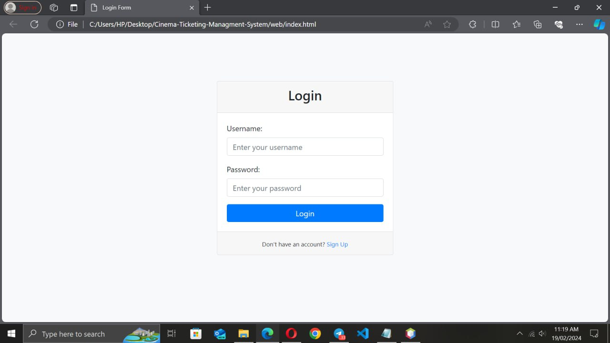
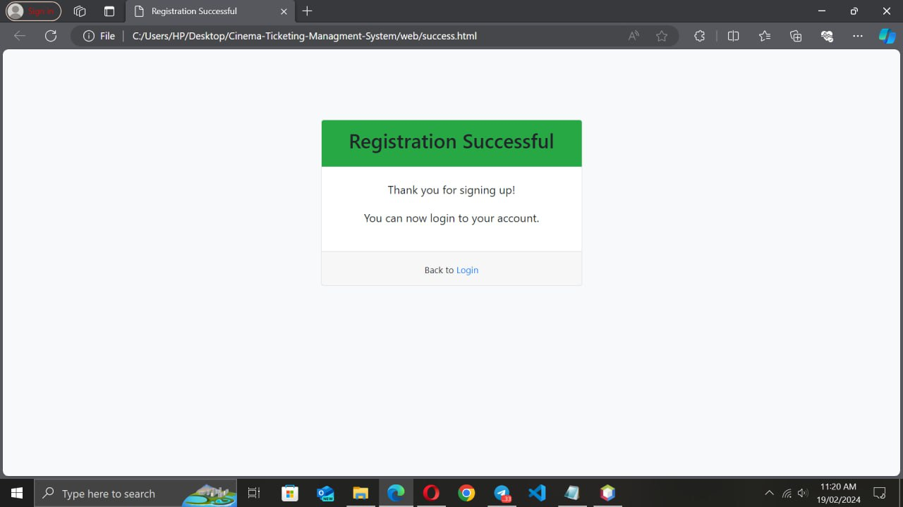
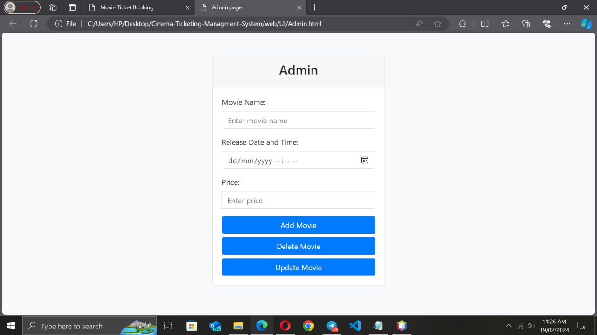

# 🎟️ Cinema Ticketing System  

## 📌 Features  
- **Event Listings**  
  - Landing page with available events
    
    
  - Event details (name, description, date & time, venue name, venue ID, address)
    
    
- **User Authentication**  
  - Sign-up page
     
  - Login page
     
  - Registration
    
  - Admin
    
    
- **Booking & Payment**  
  - Seat reservation information  
  - Secure payment process  

## 🛠️ Technology Stack  

- **Frontend:** HTML, CSS, JavaScript  
- **Backend:** Java (Servlets, JSP, Spring Boot)  
- **Database:** MySQL  

## 🚀 How to Run  
1. Install **Java** and set up a **Tomcat server** (using Servlets/JSP).  
2. Install **MySQL** and create the necessary tables.  
3. Deploy the project and start the server.  
4. Open a browser and access the platform.  
